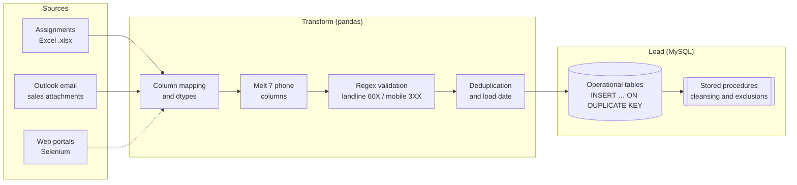

<div align="center">

# Structured Data ETLs

[Español](README.md) · **English**

Production ETLs for telemarketing (BPO) operations: extraction from Excel files, Outlook email,
and websites; cleaning and normalization with pandas; incremental loads into MySQL; and cleansing
of multi-million-row databases with stored procedures.


</div>

## Architecture



## Components

| File | Role |
|------|------|
| [`src/_etl_process_assignament.py`](src/_etl_process_assignament.py) | **Assignments ETL.** Reads every `.xlsx` in a folder, melts 7 phone columns into long format, validates Colombian numbers with regex (10-digit `60X` landlines and `3XX` mobiles), drops blanks and duplicates, exports the consolidated file, and inserts into MySQL without truncating. |
| [`src/_etl_update_ventas.py`](src/_etl_update_ventas.py) | **Daily sales ETL.** Downloads the day's attachments by sender from Outlook (`win32com`), normalizes the Home and Mobile reports (Excel serial dates, current-month filter), loads them into MySQL, and runs the stored procedures with the elapsed days of the month. |
| [`sql/_sql_sp_depuration_bdd.sql`](sql/_sql_sp_depuration_bdd.sql) | **Operational database cleansing** (millions of rows). Flags exclusions by sale, blacklist, postpaid customer, carrier, and invalid phone; updates status by channel (SMS, IVR, calls, WhatsApp); and computes an average contact rate to prioritize the least-worked records and extend the database's useful life. |
| [`src/_cls_sqlalchemy.py`](src/_cls_sqlalchemy.py) | SQLAlchemy helpers: stored procedure execution, chunked CSV/XLSX export, `ON DUPLICATE KEY UPDATE` inserts with or without truncation. |
| [`src/_cls_mysql_conector.py`](src/_cls_mysql_conector.py) | Per-server connection factory. Values in the repository are placeholders. |
| [`src/_cls_webscraping.py`](src/_cls_webscraping.py) | Selenium wrapper: profiles, downloads, headless mode, and explicit waits by XPATH/CSS. |
| [`src/_cls_nav_directorys.py`](src/_cls_nav_directorys.py) | Portable relative paths. |

## Design decisions

- **Idempotent loads:** `INSERT … ON DUPLICATE KEY UPDATE` lets a load be re-run without duplicating rows.
- **Validation at the source:** phone numbers are normalized (digits only) and validated before reaching the database, so invalid numbers are never worked.
- **Heavy logic in SQL:** cleansing millions of rows runs as a stored procedure inside MySQL, close to the data, instead of pulling it into Python.
- **Configuration outside the code:** schemas, tables, paths, and procedures are passed as a dictionary when each ETL is instantiated.

## How to run

```bash
git clone https://github.com/RonaldBarberi/structured_data_etls.git
cd structured_data_etls
pip install -r config/requerimients.txt
# Set server, user, and schema in src/_cls_mysql_conector.py (or, better, in environment variables)
cd src && python _etl_process_assignament.py
```

> `_etl_update_ventas.py` requires Windows with Outlook installed (`pywin32`).

---

<p align="center">
  <b>Ronald Barberi</b> · Data Scientist & Data Engineer ·
  <a href="https://www.linkedin.com/in/ronald-eduardo-barberi-ria%C3%B1o-rebr/">LinkedIn</a> ·
  <a href="https://github.com/RonaldBarberi">GitHub</a>
</p>
