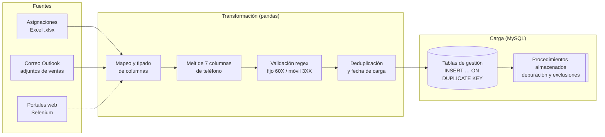

<div align="center">

# Structured Data ETLs

**Español** · [English](README.en.md)

ETLs de producción para operación de telemercadeo (BPO): extracción desde Excel, correo de
Outlook y sitios web; limpieza y normalización con pandas; carga incremental a MySQL y
depuración de bases de millones de registros con procedimientos almacenados.


</div>

## Arquitectura



## Componentes

| Archivo | Rol |
|---------|-----|
| [`src/_etl_process_assignament.py`](src/_etl_process_assignament.py) | **ETL de asignaciones.** Lee todos los `.xlsx` de una carpeta, pasa 7 columnas de teléfono a formato largo, valida números colombianos con regex (fijos `60X` de 10 dígitos y móviles `3XX`), elimina vacíos y duplicados, exporta el consolidado e inserta en MySQL sin truncar. |
| [`src/_etl_update_ventas.py`](src/_etl_update_ventas.py) | **ETL de ventas diarias.** Descarga por remitente los adjuntos del día desde Outlook (`win32com`), normaliza los reportes de Hogar y Móvil (fechas seriales de Excel, filtro del mes en curso), los carga a MySQL y ejecuta los procedimientos almacenados con los días transcurridos del mes. |
| [`sql/_sql_sp_depuration_bdd.sql`](sql/_sql_sp_depuration_bdd.sql) | **Depuración de la base de gestión** (millones de registros). Marca exclusiones por venta, lista negra, cliente pospago, operador y teléfono inválido; actualiza el estado por canal (SMS, IVR, llamadas, WhatsApp) y calcula una tasa promedio de transacciones para priorizar los registros menos gestionados y alargar la vida útil de la base. |
| [`src/_cls_sqlalchemy.py`](src/_cls_sqlalchemy.py) | Utilidades SQLAlchemy: ejecución de SP, exportación a CSV/XLSX por *chunks*, inserción `ON DUPLICATE KEY UPDATE` con o sin truncado. |
| [`src/_cls_mysql_conector.py`](src/_cls_mysql_conector.py) | Fábrica de conexiones por servidor. Los valores del repositorio son de ejemplo. |
| [`src/_cls_webscraping.py`](src/_cls_webscraping.py) | Envoltorio de Selenium: perfiles, descargas, modo *headless* y esperas explícitas por XPATH/CSS. |
| [`src/_cls_nav_directorys.py`](src/_cls_nav_directorys.py) | Rutas relativas portables. |

## Decisiones de diseño

- **Inserción idempotente:** `INSERT … ON DUPLICATE KEY UPDATE` permite re-ejecutar la carga sin duplicar registros.
- **Validación en origen:** los teléfonos se normalizan (solo dígitos) y se validan antes de llegar a la base, para no gestionar números inválidos.
- **Lógica pesada en SQL:** la depuración de millones de filas corre como procedimiento almacenado dentro de MySQL, cerca de los datos, en lugar de traerlos a Python.
- **Parámetros fuera del código:** esquemas, tablas, rutas y procedimientos se pasan por diccionario al instanciar cada ETL.

## Cómo ejecutar

```bash
git clone https://github.com/RonaldBarberi/structured_data_etls.git
cd structured_data_etls
pip install -r config/requerimients.txt
# Ajusta servidor, usuario y esquema en src/_cls_mysql_conector.py (o, mejor, en variables de entorno)
cd src && python _etl_process_assignament.py
```

> `_etl_update_ventas.py` requiere Windows con Outlook instalado (`pywin32`).

---

<p align="center">
  <b>Ronald Barberi</b> · Data Scientist & Data Engineer ·
  <a href="https://www.linkedin.com/in/ronald-eduardo-barberi-ria%C3%B1o-rebr/">LinkedIn</a> ·
  <a href="https://github.com/RonaldBarberi">GitHub</a>
</p>
